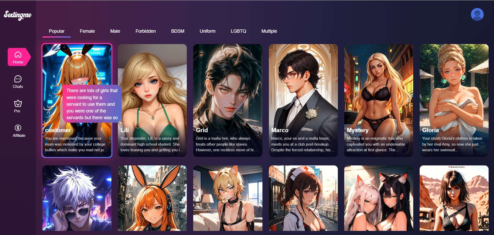
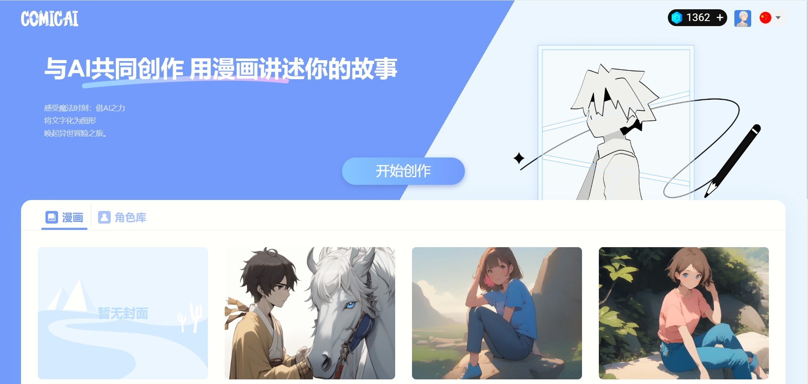
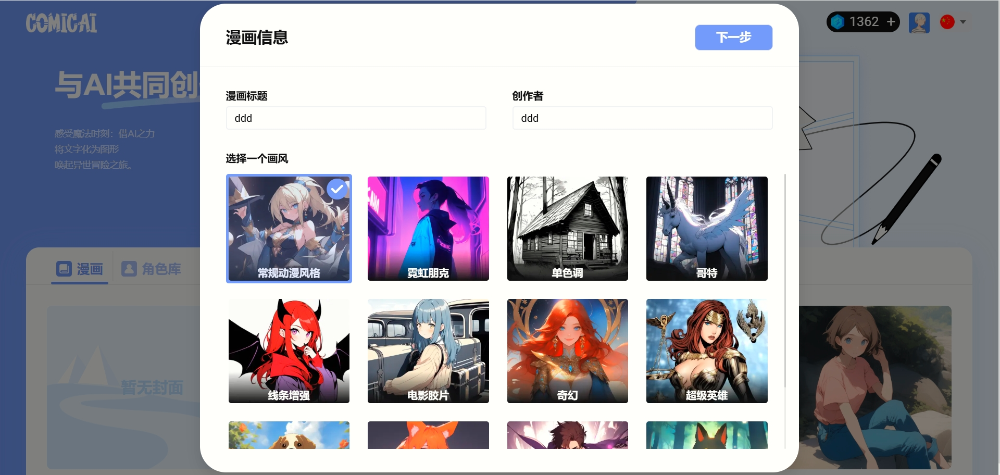
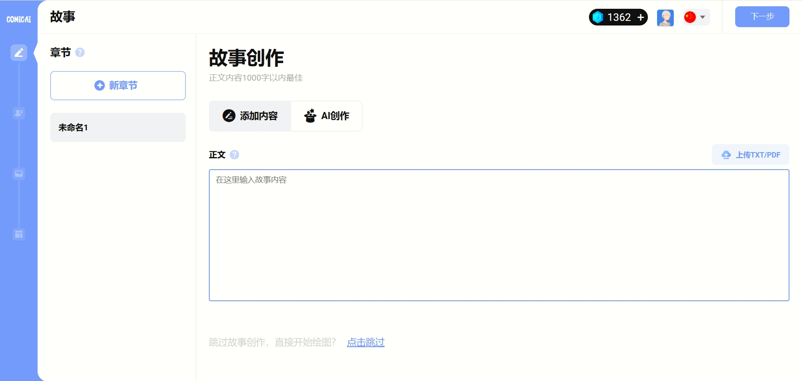
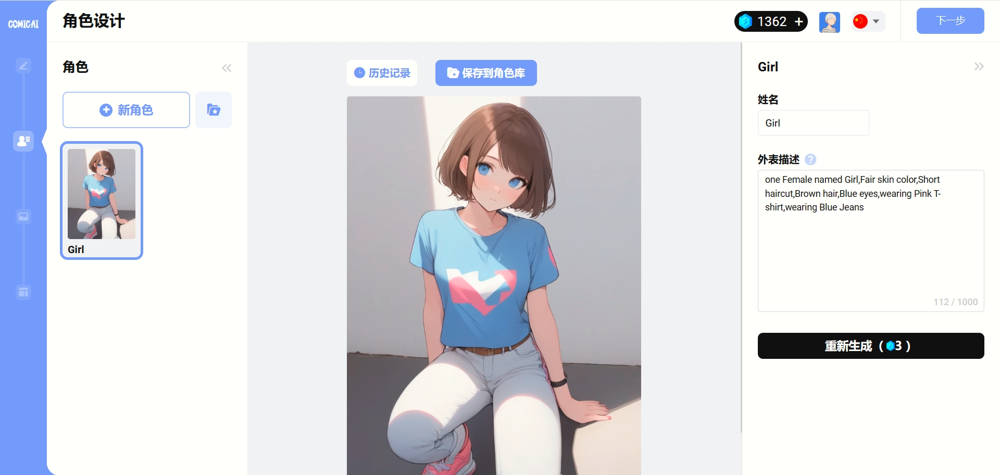
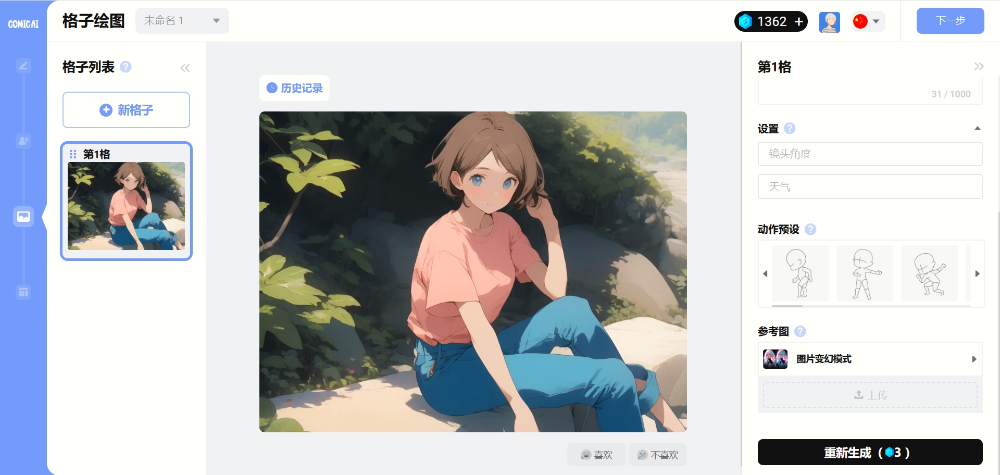
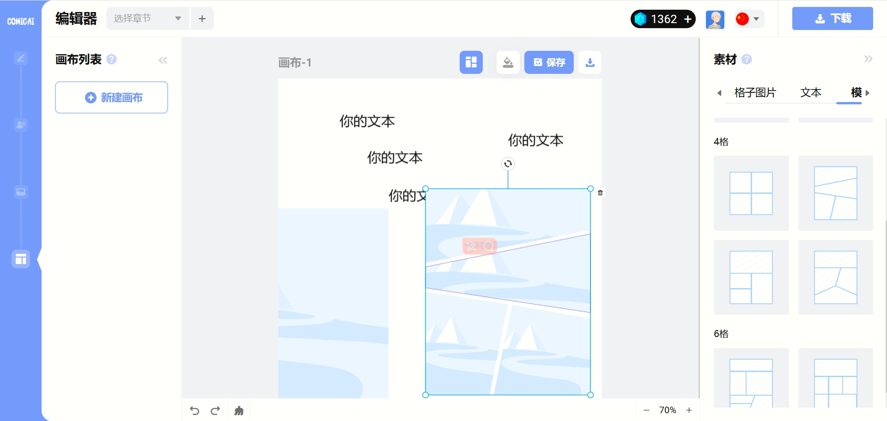
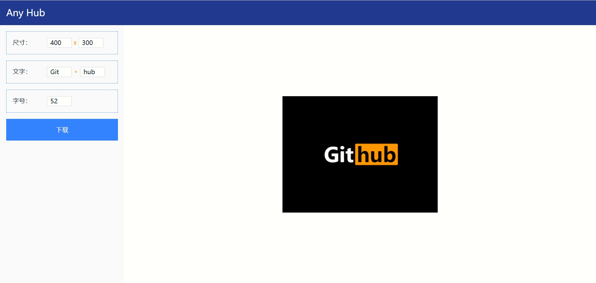
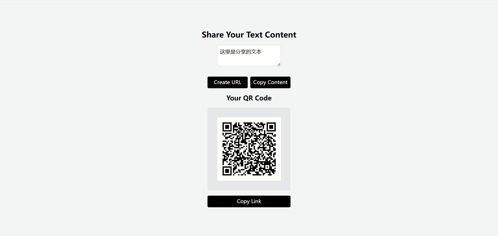
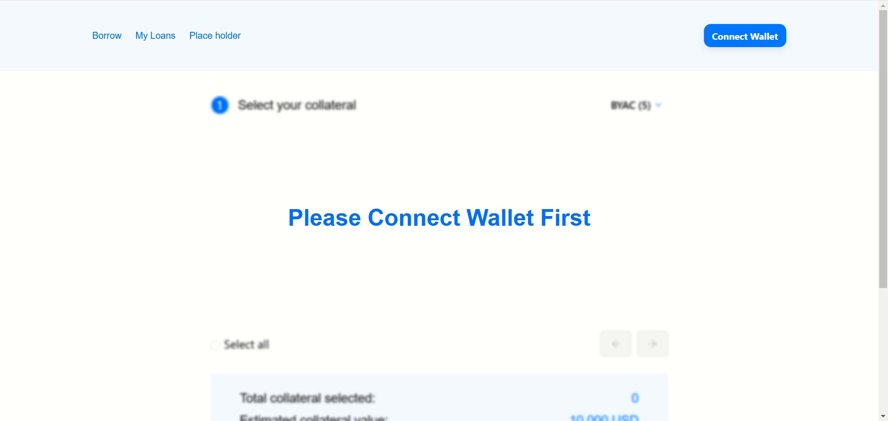

# Projects
## 1. sextingme.ai

AI 交友平台，这个我是owner，前端3个人，后端2个。前端的使用nuxt做的，后端使用的go+gin。技术选型、性能优化、埋点、seo都是我做的。

## 2. comicai.ai
现在这个项目已经下线了，截图是v3版本，这个项目最后迭代到v7版本。这个平台当时主要是我跟我同事两个人做

## 3. 一个web3 赌博游戏
抄的一个web3 赌博网站的游戏，素材都是直接扒的那个网站的，用的pixijs，本来跟那个老哥约定的是要做8个游戏，但是给了第一个就联系不上了
[视频](./mines-game.mp4)

## 4. 太空侵略者游戏
用phaser3 做的，素材用的都是开源素材
[视频](./invader.mp4)
## 5. 类似超级玛丽的通关游戏
用phaser3 做的，素材用的都是开源素材
[视频](./mario.mp4)
## 6. 生成pornhub样式的图片的小工具
用原生js+canvas写的，[地址](https://shiuwn.github.io/any-hub/)

## 7. 分享文本的小工具
用rescript写的，主要是为了在不在电脑上开微信的情况下，将文本复制到手机上，[地址](https://shiuwn.github.io/share-text-app/)

## 8. 短链接服务
输入一个长连接，返回一个短链接大概长这样`https://9uv.top/s/xxxx`。前端用的rescript+next写的，后端用的go+gin写的，数据库用的mongo。前端托管到了vercel上面，后端托管到了aws上面。之所以用这套东西，是因为aws白嫖了一年，mongo可以白嫖免费额度，vercel可以免费使用。之前本打算全放aws上面，但是没有证书，访问的时候会提示不安全，所以分开放的。现在mongo登不上去了，所以一直报错。[地址](https://9uv.top)
## 9. NFT 抵押平台
跟一个老哥一块搞的，前后端我来负责，合约他找人写的，他负责找钱。后来老哥和写合约的闹掰了，他也没找到钱，这个项目就黄了。前端用的react，后端用的node，这个需要实时交易用的socketIO做的。

